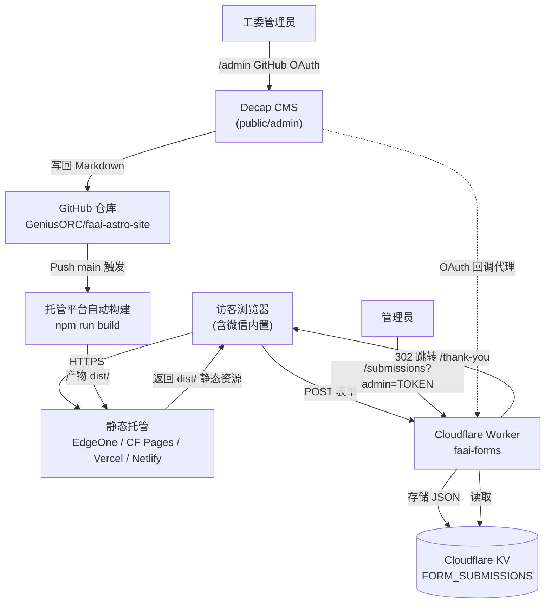
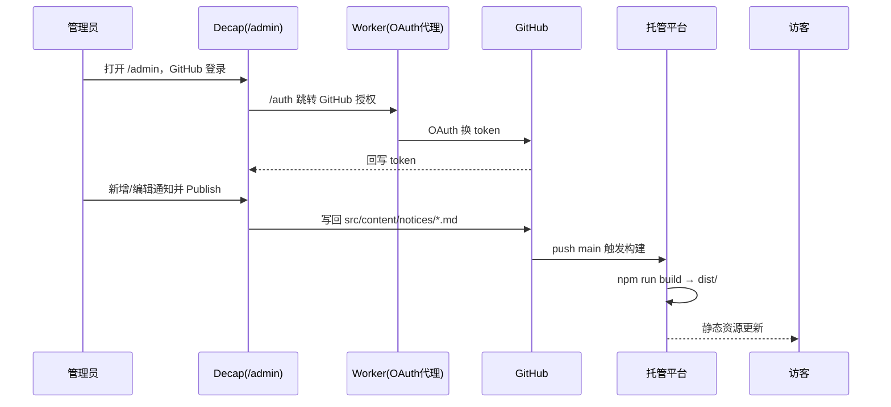
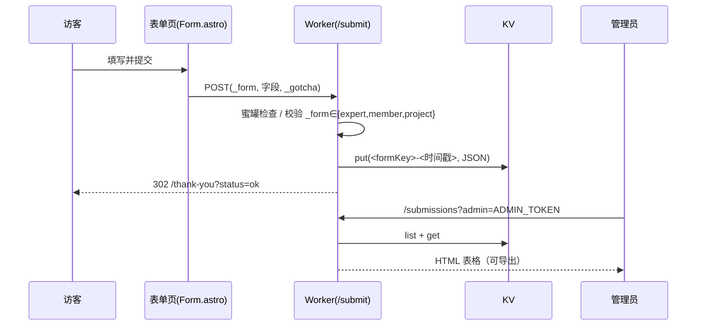

# 系统架构设计说明书

| 项目 | 内容 |
| --- | --- |
| 文档名称 | 企工委官网 · 系统架构设计说明书 |
| 版本 | v1.0 |
| 日期 | 2026-07-20 |
| 适用范围 | 福建省人工智能学会企业工作委员会官网（Astro 实装版） |
| 状态 | 已基线 |

> **关于历史方案**：根目录 `企工委网站建设方案.md`、`企工委网站_执行计划.md` 为早期 Halo 方案，已废弃，仅作历史参考。本文档以当前 Astro 实装为准。

---

## 1. 架构总览

系统由四部分组成：**Astro 静态站（前台）** + **Decap CMS（内容后台）** + **Cloudflare Worker（表单与 OAuth 代理）** + **Cloudflare KV（表单存储）**。整体无自有数据库与服务端，构建期生成纯静态 HTML，由静态托管分发。



---

## 2. 技术栈

| 层 | 技术 | 说明 |
| --- | --- | --- |
| 前端框架 | Astro 5（SSG，MIT） | 唯一运行时依赖 `astro ^5.0.0` |
| 样式 | 手写 CSS（CSS 变量 + 响应式），无 UI 框架 | `src/styles/global.css` |
| 内容管理 | Decap CMS 3（MIT，自托管） | `public/admin/`，写回 Git |
| 表单后端 | Cloudflare Workers + KV | `worker/index.js` + `worker/wrangler.toml` |
| 部署工具 | wrangler ^4.112.0（devDependency） | 仅用于部署 Worker |
| 托管 | EdgeOne / Cloudflare Pages / Vercel / Netlify | 任选，构建 `npm run build` → `dist/` |

---

## 3. 目录结构

```
astro-site/
├── astro.config.mjs        # 站点配置（site / trailingSlash / build.format）
├── package.json            # 依赖与脚本（dev/build/preview）
├── tsconfig.json           # extends astro/tsconfigs/strict
├── src/
│   ├── site.ts             # 全站配置 SITE/NAV（formEndpoint 在此）
│   ├── layouts/BaseLayout.astro   # HTML 骨架 + Header + Footer + OG
│   ├── styles/global.css   # 设计系统（颜色/响应式）
│   ├── components/
│   │   ├── Header.astro / Footer.astro   # 导航与页脚
│   │   ├── Form.astro      # 通用表单（POST 到 endpoint）
│   │   ├── Gallery.astro   # 活动精选轮播
│   │   ├── ModuleCard.astro# 服务大厅条目
│   │   └── NoticeList.astro# 通知列表
│   ├── content/
│   │   ├── config.ts       # notices 集合 zod schema
│   │   └── notices/*.md    # 通知内容（frontmatter + 正文）
│   └── pages/
│       ├── index.astro             # 首页
│       ├── gong-wei-jian-jie.astro # 工委简介
│       ├── xu-qiu-ku.astro         # 企业需求库（暂占位）
│       ├── zhuan-jia.astro         # 专家登记（formKey=expert）
│       ├── ru-hui.astro            # 入会申请（formKey=member）
│       ├── ke-ti.astro             # 课题申请（formKey=project）
│       ├── thank-you.astro         # 提交结果页
│       └── notices/
│           ├── index.astro         # 通知列表
│           └── [slug].astro        # 通知详情
├── public/admin/           # Decap CMS 前端（config.yml + index.html）
└── worker/                 # 表单后端 + OAuth 代理
    ├── index.js
    └── wrangler.toml
```

---

## 4. 路由与组件职责

### 4.1 页面路由
| 路由 | 页面 | 数据源 |
| --- | --- | --- |
| `/` | 首页（Hero/活动精选/服务大厅/通知列表） | notices 集合 |
| `/gong-wei-jian-jie` | 工委简介 | 硬编码 |
| `/xu-qiu-ku` | 企业需求库 | 硬编码（提交待建） |
| `/zhuan-jia` | 专家登记 | Form 组件 + Worker |
| `/ru-hui` | 入会申请 | Form 组件 + Worker |
| `/ke-ti` | 课题申请 | Form 组件 + Worker |
| `/thank-you` | 提交结果（读 `?form=&status=`） | URL 参数 |
| `/notices` | 通知列表 | notices 集合 |
| `/notices/[slug]` | 通知详情 | notices 集合 Markdown |
| `/admin` | Decap 后台 | Decap UI + GitHub |

### 4.2 组件职责
- **BaseLayout**：统一 HTML 骨架、`<meta viewport>`、OG 标签、`theme-color=#1a3a6e`。
- **Header/Footer**：导航（桌面横排 / 移动折叠 `<details>`）、页脚栏目与版权。
- **Form**：通用受控表单，渲染字段、隐藏 `_form`/`_gotcha`，`action=endpoint`。
- **Gallery / ModuleCard / NoticeList**：首页展示组件。

---

## 5. 内容管理流程（Decap → Git → 重建）



---

## 6. 表单数据流（表单 → Worker → KV → 导出）



---

## 7. 部署架构

- **前台**：`npm run build` 产物 `dist/` 上传/由 Git 推送至静态托管，绑定已备案 HTTPS 域名。
- **Worker**：`cd worker && wrangler deploy`，独立子域 `*.workers.dev`，读取密钥 `GITHUB_CLIENT_SECRET`、`ADMIN_TOKEN` 与变量 `SITE_URL`、KV 绑定 `FORM_SUBMISSIONS`。
- **解耦**：前台与 Worker 独立部署、独立扩缩，互不阻塞。

---

## 8. 设计系统

| 变量 | 值 | 用途 |
| --- | --- | --- |
| `--blue` | `#1a3a6e` | 学术蓝（主色：导航/标题/页脚） |
| `--red` | `#c8102e` | 中国红（强调：顶边/标题下划线/提交按钮） |
| `--blue-deep` | `#14305c` | 深蓝（页脚/下拉） |
| 布局 | 最大宽 `1080px`，圆角 `10px` | 内容容器 |
| 响应式断点 | 620 / 720 / 760 / 860 / 1040px | 移动优先 |
| 字体 | 系统字体栈（PingFang SC / Microsoft YaHei…） | 无外部字体依赖 |

---

## 9. 关键配置点（上线前必改）

| 文件 | 配置项 | 说明 |
| --- | --- | --- |
| `src/site.ts` | `formEndpoint` | 改为正式 Worker 子域 `/submit` |
| `astro.config.mjs` | `site` | 改为正式域名（OG/sitemap/绝对链接） |
| `public/admin/config.yml` | `client_id` | 改为自建 GitHub OAuth App 的 Client ID |
| `worker/wrangler.toml` | `SITE_URL` | 改为正式站点域名 |
| `worker/wrangler.toml` | `ADMIN_TOKEN` | 强口令（建议 `wrangler secret put`） |
| `worker/wrangler.toml` | KV `id` | 正式 KV 命名空间 id |

---

## 10. 已知架构偏差
- **内容 schema 不一致**：`src/content/config.ts` 仅定义 `title/date/category/excerpt`，而 Decap 集合还写 `tags/cover`；需对齐（在 schema 中补充字段或调整 Decap），避免字段被丢弃或构建告警。
- **企业需求库**：当前为静态占位页，无在线提交与检索（架构上预留前端检索 + 复用表单后端）。
- **无自有服务端/数据库**：所有动态能力依赖 Cloudflare Worker，需确保该服务可用性与配额。
